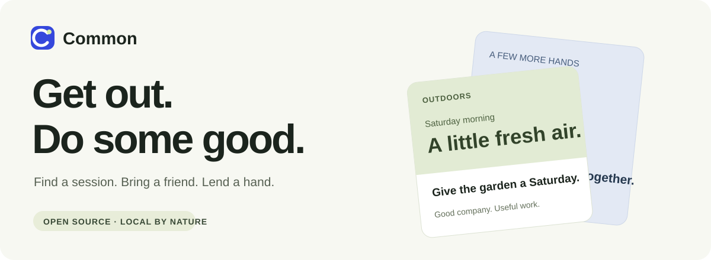
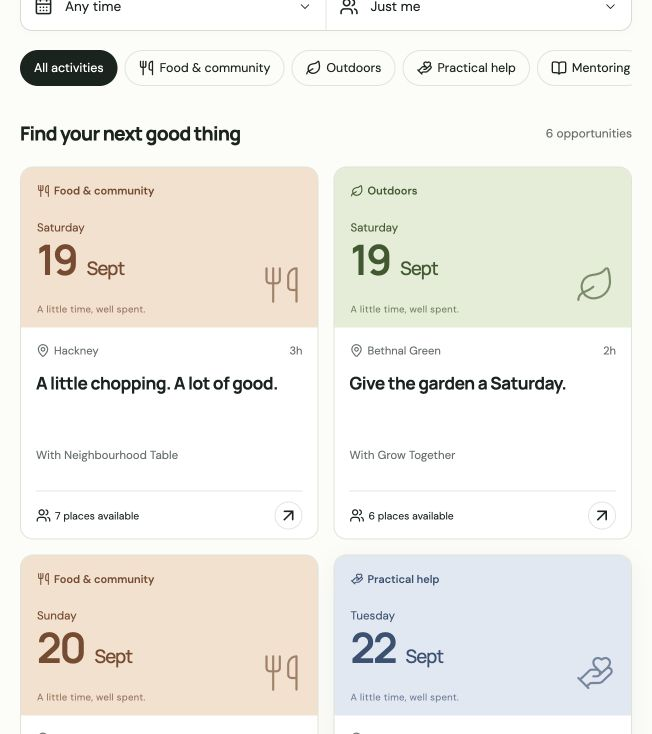
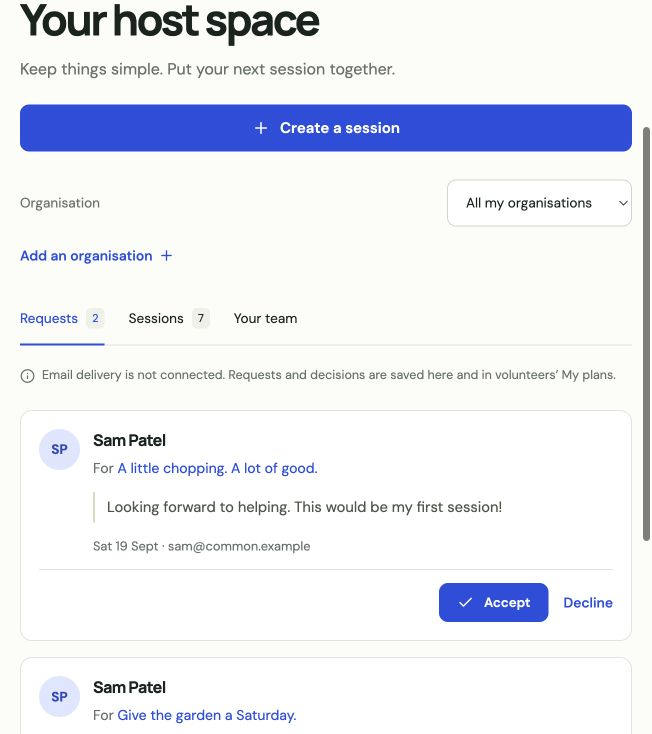

  

  <strong>A few hours. A few good people. Something useful to do together.</strong>

## Less screen time. More real life.

Common is an open-source volunteering platform we're building to help people find something useful to do near them, at a time that fits their lives.

The idea started with developers, founders and people working for themselves. We spend a lot of time at screens. Many of us would like to get out, meet people and help with something practical, but finding the right opportunity can mean searching scattered websites and sending emails before we even know what's involved.

We want to make that first step easy.

## Volunteering that fits into your week

A morning in a community garden. A few hours preparing food. Your old team getting back together to lend a hand.

You should be able to browse opportunities before signing up, see what you'll be doing and how much time it takes, and send a session to a friend. When you're ready, introduce yourself and request a place. The host confirms who can join.

**Browse → invite friends → request a place → host confirms → show up.**

Going with someone you know can make it easier to try something new. Common is being built around that simple, social way of getting involved.

## Easy for the people hosting, too

For local organisations and community groups, we want putting a session online to feel straightforward: describe what needs doing, choose a time and say how many people you can welcome.

Hosts need a simple place to review requests, keep volunteers informed and share the organising with their team. The aim is to spend less time on admin and more time doing the work people came to help with.

## Early screens

A first look at browsing and hosting. All people, organisations and opportunities shown here are fictional demo data.

| Find something to do                                                                               | Welcome volunteers                                                                                 |
| -------------------------------------------------------------------------------------------------- | -------------------------------------------------------------------------------------------------- |
|  |  |

## Start small, learn from real sessions

We have an early working version. The next step is a small pilot with five to ten known hosts and a group of volunteers, starting in East London.

We want to find out whether people can discover a session, arrange to go together and turn up with a clear idea of what to expect. Just as importantly, does it help hosts, and would both sides use it again?

That experience will guide what we build next. Our focus now is testing the idea with real people; we're not recruiting contributors at this stage.

## Open source, with room to grow

The code is [MIT licensed](LICENSE). Our ambition is to build something other communities can adapt for their own neighbourhoods and cities.

For now, we're keeping the product focused on one thing: making it easier to volunteer and to welcome volunteers.

---

<strong>Small acts. Shared company.</strong>

