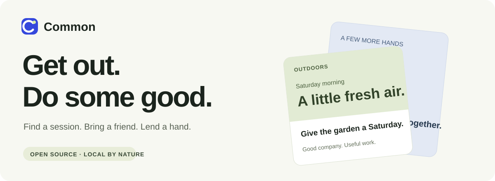
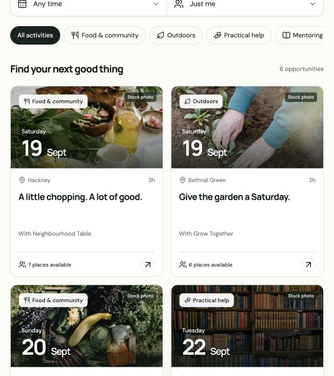
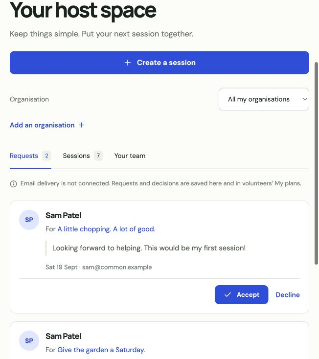

<p align="center">
  
</p>

Common is a volunteer sign-up app for one organisation or local network. Hosts post dated sessions. Volunteers request a place. Hosts accept or decline.

The project is parked. The code works and is MIT licensed. If you run volunteers, fork it and use it.

| Find something to do                                                                               | Review requests                                                                                    |
| -------------------------------------------------------------------------------------------------- | -------------------------------------------------------------------------------------------------- |
|  |  |

## What it does

- Public listings with dates, places and location.
- Google sign-in. Volunteers request a place with a short note.
- Host teams: owners invite organisers. Hosts accept, decline or change a decision.
- Capacity checks. No overbooking.
- Calendar export and optional email updates.
- Host sign-up limited to an email allowlist.

It does not do hour tracking, employer reporting, payments, recurring sessions or messaging.

## Run it

Try it with fictional data. You do not need credentials.

```sh
npm ci
npm run demo
```

To run it for real, see [docs/self-hosting.md](docs/self-hosting.md). It is one Node process with a SQLite file. A Dockerfile and a Fly.io example are included.

Stack: React, Vite, Express, Better Auth, SQLite. See [docs/architecture.md](docs/architecture.md).

## What we learned

We parked Common after we spoke with someone who ran a similar platform in San Francisco. Read this before you build a public volunteering platform:

1. Host organisations need a lot of help to write listings. Many do not answer volunteer questions, for example "Do I bring gloves?".
2. It is hard to get volunteers unless you serve a group that already exists and shares a cause.
3. Most people do not volunteer a second time. Growth goes up and then down.

[GoodGym](https://www.goodgym.org) already does this well in the UK, with a fitness angle.

The app fits better as a tool for one organisation that already has volunteers.

## Status

Not maintained. Real Google OAuth, SMTP delivery and a public HTTPS deploy have not had a full end-to-end test. Test them before you invite people. Issues and pull requests are welcome, but replies can be slow.

[MIT](LICENSE)
